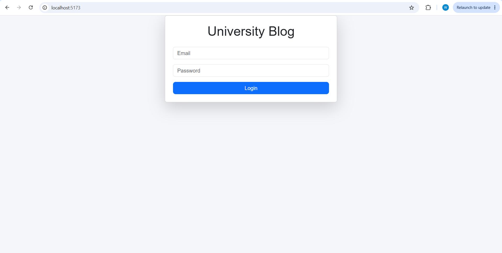
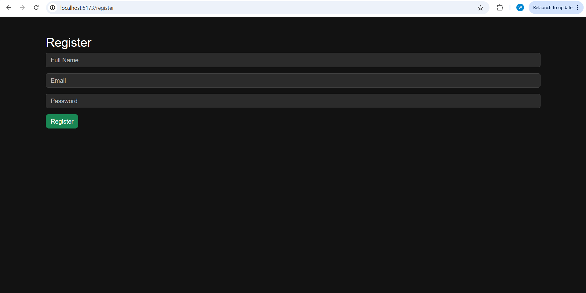
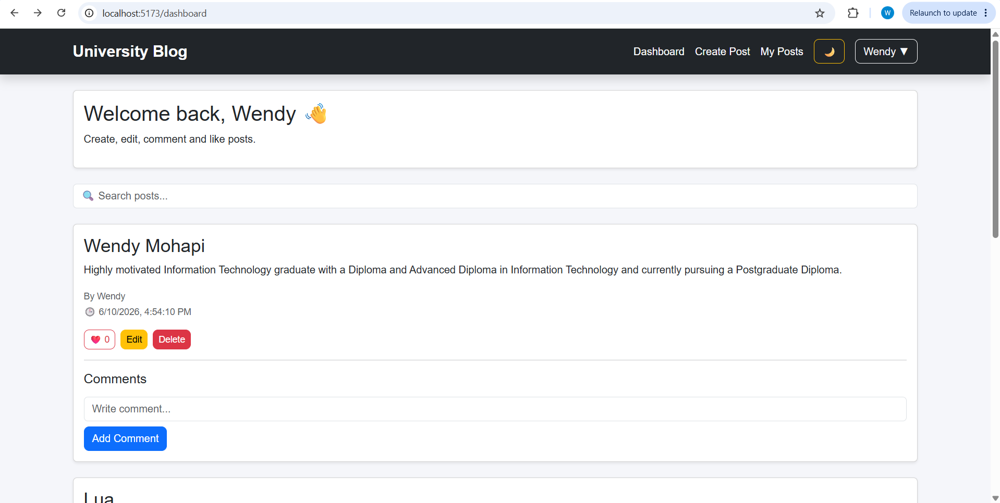
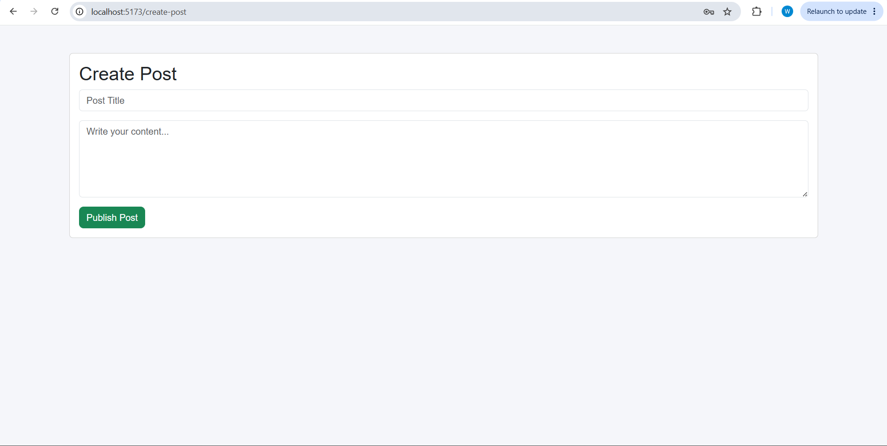
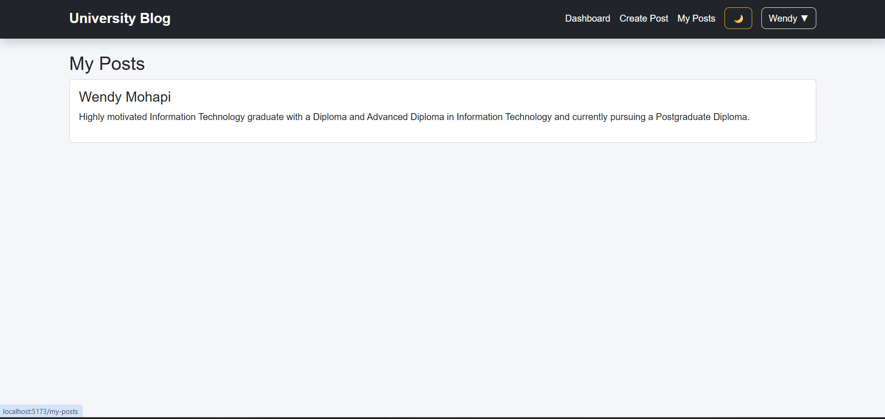
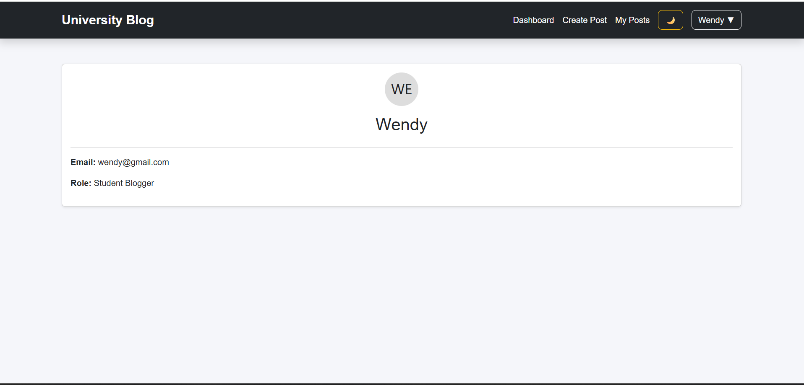
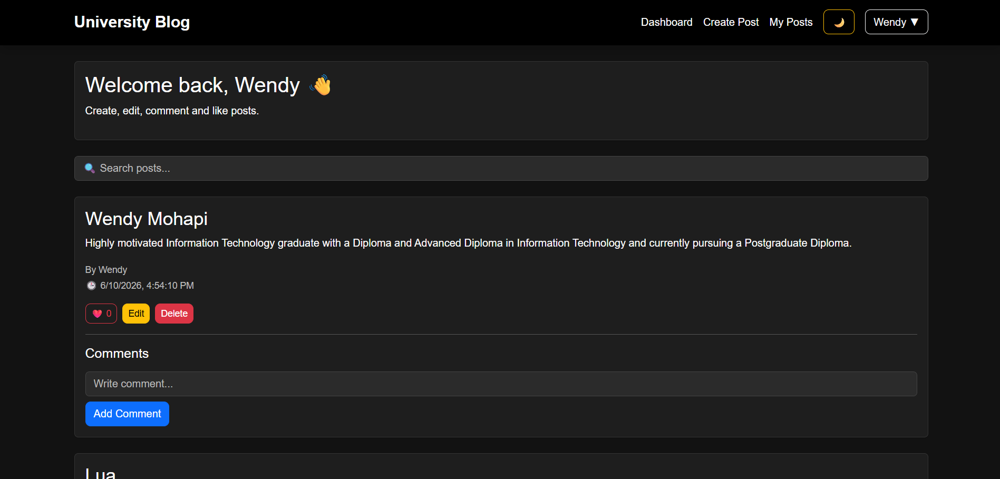

# University Blog App 
## Key Features

- JWT Authentication
- Protected Routes
- Create, Edit & Delete Posts
- Comment System
- Like System ❤️
- Search Functionality 🔎
- User Profiles 👤
- Dark Mode 🌙
- Responsive Design 📱

## Overview

University Blog App is a full-stack blogging platform that allows users to register, log in, create posts, comment on posts, like content, manage profiles, and interact with other users.

The application was built using React, Node.js, Express, MySQL, and JWT Authentication.

---

## Features

### Authentication

* User Registration
* User Login
* JWT Authentication
* Protected Routes

### Blog Features

* Create Posts
* Edit Posts
* Delete Posts
* View All Posts
* Search Posts
* My Posts Dashboard

### Social Features

* Comment System
* Like System
* User Profiles

### UI Features

* Dark Mode
* Responsive Design
* Navigation Bar
* Dashboard Overview

---

## Technologies Used

### Frontend

* React
* React Router DOM
* Axios
* Bootstrap

### Backend

* Node.js
* Express.js

### Database

* MySQL

### Authentication

* JWT (JSON Web Tokens)
* bcryptjs

---

## Installation

### Backend

```bash
cd backend
npm install
npm run dev
```

### Frontend

```bash
cd frontend
npm install
npm run dev
```

---

## Database Setup

Create a MySQL database named:

```sql
university_blog
```

Import the SQL tables included in the project.

---

## Future Improvements

* Image Uploads
* Categories & Tags
* User Avatars
* Notifications
* Admin Dashboard
* Bookmark Posts

---
## Screenshots

### Login Page



### Register Page



### Dashboard



### Create Post



### My Posts



### Profile



### Dark Mode


## Author

Wendy Mohapi

LinkedIn:
https://linkedin.com/in/wendy-mohapi-834092272/

GitHub:
https://github.com/wendiimoh
